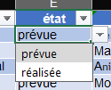
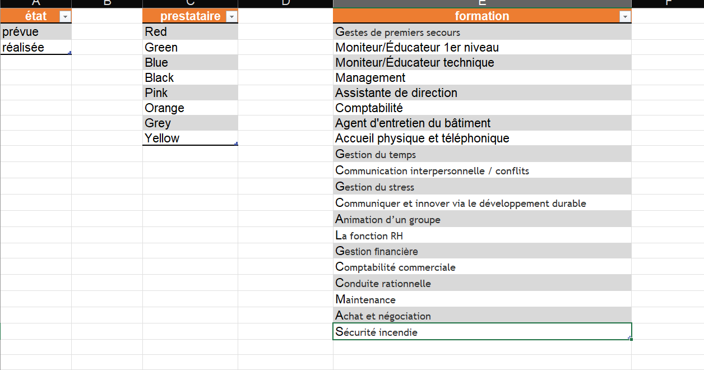

# 📊 Training Management & Monitoring System – Excel Dashboard


## 📋 Project Overview
A comprehensive Excel-based training management system designed to track employee training activities, providers, durations, completion status, and performance ratings. This tool helps HR departments efficiently plan, monitor, and evaluate training programs across the organization.

---

## Demo Video

A short demonstration of the application features:

[](https://drive.google.com/file/d/1w0a84uLUkTjE3-eBGGk5bp8u6XxRE0xp/view?usp=sharing)

*Click the image to download/play the demo video.*

---

## 🎯 Key Features

### 🔄 Automated Employee Data Lookup
- **VLOOKUP integration** automatically pulls employee details (Name, First Name, Department) from the employee directory
- Real-time data synchronization ensures consistency across all records

### 📋 Centralized Training Database
- Track all training sessions with details including:
  - Training topic (20+ different courses)
  - Service provider (8 different providers)
  - Duration in hours
  - Completion date
  - Performance rating (1-5 scale)
  - Status (Planned/Completed)

### 📊 Interactive Dashboard
- **Department-wise training hours** - Visual breakdown by department
- **Top trainees ranking** - Identify most trained employees
- **Provider performance analysis** - Average ratings by training provider

### 🗂️ Data Validation & Integrity
- Dropdown lists for standardized data entry
- Predefined lists for training topics and providers
- Consistent formatting across all sheets

---
## Files Structure


```plaintext
assets/
├── screenshots/
│   ├── Employee_List.png                # Full employee directory
│   ├── Training_Tracker_Detailed.png    # Main training database (VLOOKUP)
│   ├── Training_Dashboard_By_Year.png   # Annual training summary dashboard
│   ├── Pivot_Tables_Summary.png         # Department & provider analysis
│   └── Status_Codes_Legend.png          # Status and code definitions
├── demo/
│   └── demo_thumbnail.png               # Demo video thumbnail
└── excel_files/
    └── training_management_and_monitoring.xlsx  # Excel workbook
```


**Excel Workbook Sheets:**
| Sheet Name | Description |
|------------|-------------|
| **`bdd`** | Main training database with all records |
| **`listes`** | Reference tables for dropdown lists |
| **`RH`** | Employee directory with personal details |
| **`tableau de bord`** | Interactive dashboard with summaries |

---

## 📸 Screenshots

### 1. **Employee Directory (RH Sheet)**

*Complete employee directory with: Matricule, Nom, Prénom, Service*

### 2. **Main Training Database (bdd Sheet)**


*Core training tracker showing VLOOKUP formulas and training details*

### 3. **Annual Training Dashboard**


*"Suivi et gestion des formations" - Yearly overview (2017-2020)*

### 4. **PivotTable Analysis**


*Key analytics including training hours by department and provider performance*

### 5. **Training Status Management**


*Training status workflow with dropdown selection*

### 6. **Training Selection Dropdown**


*Standardized training topic selection from predefined lists*

### 7. **System Settings & Configuration**


*Configuration panel for providers, departments, and system parameters*

## 📈 Key Insights & Analytics

### Department Training Hours (Top 3)
| Department | Total Hours | Percentage |
|------------|-------------|------------|
| Commercial | 1,624 hours | 31.1% |
| Fabrication | 1,099 hours | 21.0% |
| Technique | 647.5 hours | 12.4% |

### Provider Performance Rankings
1. **Yellow** - 4.16/5 ⭐⭐⭐⭐⭐
2. **Grey** - 3.98/5 ⭐⭐⭐⭐
3. **Black** - 3.16/5 ⭐⭐⭐

### Most Trained Employees
- **019-BM** - 140 training hours
- **084-DP** - 136.5 training hours  
- **023-BJ** - 129.5 training hours

---

## 🚀 How to Use This System

### Adding New Training Records
1. Go to the `bdd` sheet
2. Insert a new row at the bottom
3. Enter the employee ID (`Matricule`)
4. Select training details from dropdown menus
5. Save the record

### Updating Employee Information
1. Navigate to the `RH` sheet
2. Add/update employee details
3. Changes automatically reflect in the training database

### Viewing Reports
1. Check the `tableau de bord` sheet for:
   - Department summaries
   - Employee rankings
   - Provider performance


---

## 🛠️ Technical Implementation

### Formulas Used
- **VLOOKUP**: `=RECHERCHEV([@Matricule];Tableau5;2;0)` - Employee data retrieval
- **SUMIFS**: Department-wise calculations
- **AVERAGE**: Provider performance ratings
- **Structured References**: Table-based formulas

### Data Validation
- Dropdown lists from `listes` sheet
- Date format validation
- Numeric range validation for ratings (1-5)

### Dashboard Features
- PivotTables for dynamic analysis
- Automatic calculations
- Color-coded sections for better readability
- Interactive filtering by year, department, and status

---

## 🔄 Maintenance & Updates

### Regular Updates Required
1. Add new training records after each session
2. Update employee directory when hiring/terminating
3. Review and add new training topics as needed

### Quality Checks
- Verify VLOOKUP formulas after adding new employees
- Check data validation ranges periodically
- Validate dashboard calculations quarterly

### Backup Recommendations
1. Save weekly backups in `assets/excel_files/` with date stamps
2. Maintain version history of major changes
3. Archive completed training years separately

---


